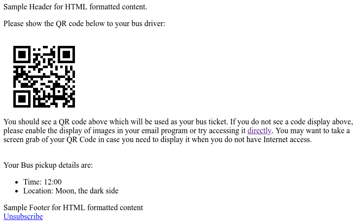
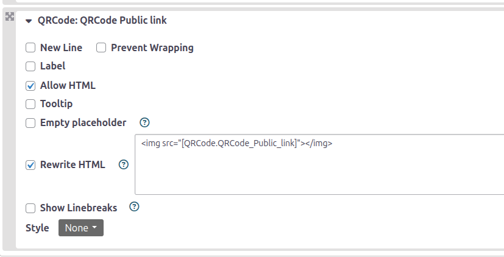
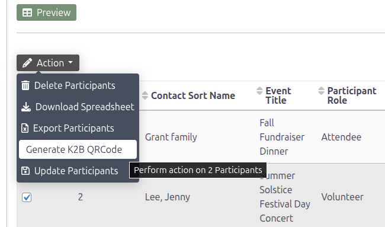

# k2b-qrcode

This implements a hook for net.ourpowerbase.qrcodecheckin that generates qrcode tokens with organisation specific information.
It also adds some SearchKit features.

The extension is licensed under [AGPL-3.0](LICENSE.txt).

## Requirements

* net.ourpowerbase.qrcodecheckin (https://github.com/progressivetech/net.ourpowerbase.qrcodecheckin).

## Usage

### Display using SearchKit

When a QRCode is generated it is stored in a Participant Custom Field "QRCode Public link".

This means you can use it to display in a SearchKit display for example:

### Generate using SearchKit Action (and Participant.generateK2bqrcode)

An action is provided for SearchKit that lets you generate QRCodes for any participant:

### Customised qrcode tokens

* qrcode_url_<eventID>
* qrcode_html_<eventID>

We replace/customise the contents of the QRCode for the specific needs of the organisation.

Include the qrcodecheckin tokens in an email.
  
#### The qrcode in the email will contain:

* CurrentYear
* Team Number
* ContactID of the individual
